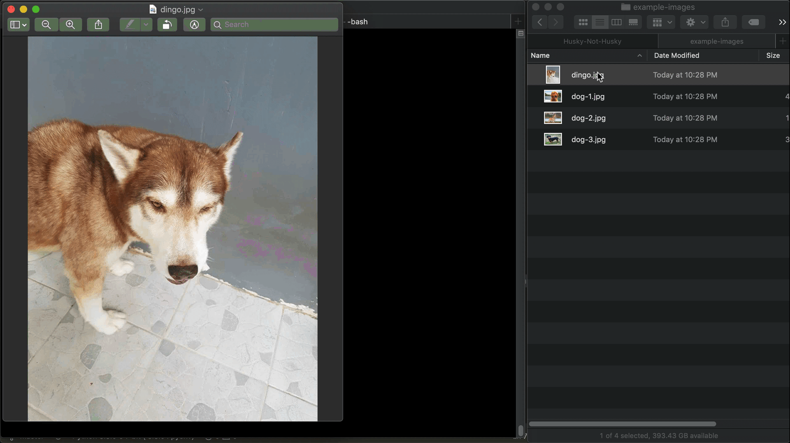

# Husky-Not-Husky App



This repo demonstrates how we can use Amazon Rekognition Custom Labels to build a simple application to identify Siberian Husky in given image. Husky-Not-Husky app uses datasets from [Stanford Dogs Dataset](http://vision.stanford.edu/aditya86/ImageNetDogs/) — amazingly provided by Stanford University. Number of images has been reduced to include Siberian Husky and randomly chosen other dog breeds.

This repo is for demonstration only and not designed for production use.

# Usage
```
python app.py --arn YOUR_MODEL_ARN --s3-bucket YOUR_S3_BUCKET --s3-path YOUR_S3_PATH --action start|stop|identify
```
# Related Repo(s)
- [Ardi Hanitya](https://github.com/immma) rewrote this application in Node.js. Heads up to [his repo](https://github.com/immma/NodeJS-Rekognition-Husky-Not-Husky) if you're looking how to call Amazon Rekognition Custom Labels API in Node.js.  
